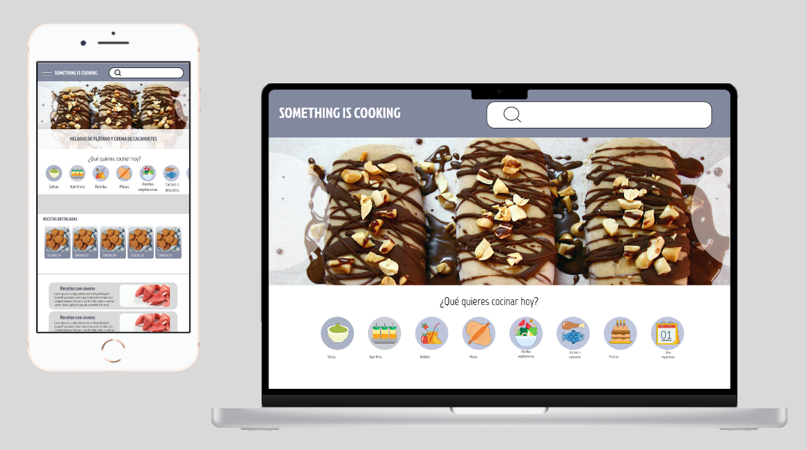

###### Something is Cooking


***

## 💻 Tabla de Contenidos
1. [Información General](#información-general)
2. [Capturas de Pantalla](#capturas-de-pantalla)
3. [Características técnicas de diseño](#🎨-características-técnicas-de-diseño)
4. [Tecnologías](#🛠️-tecnologías)
5. [Instalación](#instalación)
6. [Hoja de ruta](#hoja-de-ruta)
7. [Enlaces de interés](#🔗-enlaces-de-interés)
8. [Contacto](#🤝-contacto)

***
## ℹ️ Información General

**Something is Cooking** es un proyecto personal que llevo varios años creando.  En él uno dos de mis grandes pasiones: el mundo audiovisual y la cocina. 

Grabo recetas de cocina, y las subo a un canal de YouTube, y a redes sociales.

Y ahora, estoy creando esta web, para poder compartir mis recetas de forma escrita, y así tener un alcance mayor.

*Proyecto en proceso de desarrollo*   

## 📋 [Presentación del proyecto](https://www.canva.com/design/DAFNi5OKi_w/7oM3yrKq2Um6uIjQ2tPPAQ/view?utm_content=DAFNi5OKi_w&utm_campaign=designshare&utm_medium=link&utm_source=publishsharelink)

***

## 🖼️ Captura de pantalla




***
## 🎨 Características técnicas de diseño 
### Gama de colores: 


### Fuentes de letra: 
- Marvel
- Jockey 

***

## 🛠️ Tecnologías
Lista de tecnologías utilizadas en el desarrollo del proyecto:
* React js. (18.2)
* Axios (0.27.2)
* Json-server (0.17.0)
* Syled Components (5.3.5)
* Bootstrap (5.2)

***

## 🚀 Instalación

1.  Ingresar en Visual Studio Code
2.  Clonar el proyecto con el comando: 

 ``` 
git clone https://github.com/carolineromero/web-recetas.git
```


3. Abrir una nueva terminal y poner: 
 ``` 
json-server --watch "src/assets/data/data.json"
```
4. Abrir otra terminal e instalar las dependencias:
 ``` 
npm i
```

5. Ejecutar el siguiente comando, para abrir en el navegador
 ``` 
npm start
```
***
## 🗺️ Hoja de ruta

En esta primera entrega, presento una web responsive, capaz de leer datos de un archivo json.

En futuras actualizaciones las features a realizar son:

* Menú slider funcional, y con subcategorias.
* Buscador
* Paginación
* Api externa
* Base de datos
* Testing


## 🔗 Enlaces de interés

* [Prototipo figma](https://www.figma.com/file/jetl8b4oaoR1oBQNa2jWFT/Something-is-Cooking?node-id=0%3A1)  
* [Proyecto web](https://somethingiscooking.netlify.app/)

## 🤝 Contacto

Carolina Romero - carolinaroomero@gmail.com

[Linkedin](https://www.linkedin.com/in/carolinaroomero/)
